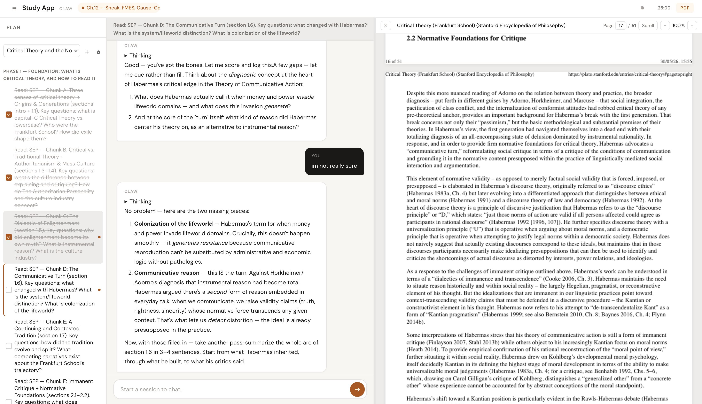

<h1 align="center">marginalia</h1>

<p align="center">
  <b>An app designed to be operated by an AI agent — not just by a human clicking a UI.</b>
</p>

<p align="center">
  A personal study tutor (Go · SQLite · RAG) whose every operation is reachable through<br>
  three doors: a web UI, a token-gated HTTP API, and a CLI the agent drives.
</p>

<p align="center">
  
  
  
  
  
</p>

<p align="center">
  <a href="#highlights">Highlights</a> ·
  <a href="#architecture">Architecture</a> ·
  <a href="#reading-the-source">Reading the source</a> ·
  <a href="#running-locally">Running locally</a> ·
  <a href="#documentation">Docs &amp; ADRs</a>
</p>

<p align="center">
  
</p>

> **Live deployment:** the app runs on a home server, used daily for real study sessions
> across multiple courses. It's bearer-token gated (private study data), so there's no
> public demo — see the screenshot above. The design is detailed below and in
> [`docs/specs/architecture.md`](docs/specs/architecture.md).

marginalia is a single Go binary: an embedded single-page frontend, SQLite for all state,
RAG over a local course corpus, and an LLM tutor that reads your slides, tracks a study
plan, and takes notes with you. The part worth a look is the architecture *around* the
tutor — see [Highlights](#highlights).

## Table of Contents

- [Highlights](#highlights)
- [Architecture](#architecture)
- [Reading the source](#reading-the-source)
- [Running locally](#running-locally)
- [Tests](#tests)
- [Deploying](#deploying)
- [Documentation](#documentation)
- [Stack](#stack)
- [Contributing](#contributing)
- [Changelog](#changelog)
- [License](#license)

## Highlights

What makes this more than a CRUD app with a chat box:

- **One implementation, three callers.** Each operation is a single `agent.App` method.
  The browser reaches it over HTTP, an *external* agent reaches the same method over the
  token-gated JSON API, and the *in-sandbox* agent reaches it through `claw-cli`.
  `App.LoadPlan` / `App.SavePlan` / `App.UpdateSessionTopic` each have one body and
  two-or-three front doors — so the app never rots into a human-only UI with a brittle
  API bolted on.

- **The agent's context is rendered from the database, per turn.** Before each agentic
  turn, `agent/sandbox.go` runs `claw-cli memory load` to synthesize a fresh `AGENTS.md`
  briefing out of live state: profile, project/feedback memory, recent sessions, the
  skills index, plan status, open-PDF hints, course steering, and the pedagogy rules. The
  agent gets a briefing assembled from app state every time it runs, not a static prompt.

- **`claw-cli` is the agent's hands** (`claw-cli/main.go`, ~1,400 lines) — a real,
  scriptable surface built for a non-human operator: `plan show/status/toggle/rewrite`,
  `pdf list/current/extract`, `rag search`, `memory load/search/save`,
  `course settings get/set`, `knowledge create/show/list`, `confidence trajectory`,
  `note save`, `session topic`, `web fetch`, `skill dispatch`.

- **One agentic chat runtime.** `/chat` spawns a `pi` coding-agent subprocess in a
  per-session sandbox, streaming `token / reasoning / tool_start / tool_end / done` events
  to the browser over SSE. (An earlier in-process Go tool loop was removed in favor of this
  single Pi-backed path; the decision is recorded in
  [ADR&nbsp;0006](docs/adr/0006-embed-pi-as-agent-runtime.md).)

- **Boring-on-purpose substrate.** Single binary, no Docker
  ([ADR&nbsp;0003](docs/adr/0003-no-docker-portability-first.md)), vanilla JS with no build
  step ([ADR&nbsp;0004](docs/adr/0004-vanilla-js-frontend.md)), no service/repository layer
  ([ADR&nbsp;0002](docs/adr/0002-no-service-repository-layer.md)), deliberately chosen
  SQLite pragmas. Shipped via `scp` + user systemd + a cloudflared tunnel, backed up with
  restic. It runs in production and has a rollback procedure.

## Architecture

- `main.go` — entry point; loads config, opens DB, builds `agent.App`, registers routes, starts the HTTP server with timeouts and graceful shutdown.
- `agent/` — domain logic. `App` owns the DB connection and config (no package globals). Submodules: `db.go` (sqlite, WAL+busy_timeout+foreign_keys+synchronous=NORMAL pragmas), `llm.go` (OpenAI-compatible client for non-streaming completions — titles and session summaries), `pi_runner.go` + `sandbox.go` (the Pi subprocess runtime and its per-session AGENTS.md), `vectorstore.go` + `chunker.go` (corpus indexing and cosine-similarity retrieval), `embed.go`, `memory.go`.
- `handler/` — HTTP layer. Each domain (sessions, plan, pdf, courses, static, auth) has its own file. All handlers hang off `*Handler` which carries `*App`, `*LLMClient`, and the embedded static FS.
- `claw-cli/` — the command surface the in-sandbox agent uses; calls the same `agent.App` methods as the handlers.
- `static/` — single-page frontend (HTML + vanilla JS, plus pdf.js for the viewer).
- `convert/` — separate binary for one-off corpus conversion.

The runtime state lives under `VAULT_ROOT`:
```
$VAULT_ROOT/
├── data/
│   ├── study.db          # sessions, messages, plan toggles, PDF metadata
│   ├── corpus/           # source markdowns indexed for RAG
│   ├── pdf-files/        # uploaded PDFs
│   ├── pdf-texts/        # extracted text per PDF
│   ├── agent-sessions/   # per-session Pi sandboxes (AGENTS.md, pi-session/)
│   └── plans/<id>.json   # per-course plans
└── memory/               # study notes, runbooks, project context
```

## Reading the source

A short, ordered trail rather than browsing alphabetically:

1. [`CONTEXT.md`](./CONTEXT.md) — the glossary. `Course → Plan → Task → Session`, Knowledge Component, Studying/Authoring/Steering. The data model and UI fall out of these definitions; read this first.
2. [`docs/adr/`](docs/adr/) — the *why*. Skim all 17; read 0002, 0006, 0009, 0011, 0007.
3. `main.go` (~185 lines) — the whole wiring diagram in one file.
4. `handler/handler.go : Register()` — every route in one place. Pick one and follow it.
5. `handler/chat.go` → `agent/sandbox.go` → `agent/pi_runner.go` — the agentic brain.
6. `claw-cli/main.go` — the agent's hands; closes the loop.
7. `agent/db.go` (schema first) and `agent/vectorstore.go` + `chunker.go` + `embed.go` — data & RAG.

## Running locally

marginalia is a single Go binary. The fastest way to see it work is the
**5-minute path** below, using the bundled [sample corpus](examples/sample-corpus/).

**Prerequisites:** Go ≥ 1.24. (Contributor tooling — Node/ESLint/golangci-lint/git
hooks — is covered under [Contributing](#contributing--conventions); it is not
needed just to run the app.)

### 5-minute path (OpenAI)

```bash
git clone https://github.com/hirojinho/marginalia.git
cd marginalia

# 1. Config — fill in your OpenAI key
cp .env.example .env
$EDITOR .env                       # set LLM_API_KEY=sk-...

# 2. Load the sample corpus into the vault
mkdir -p ./vault/data/corpus
cp examples/sample-corpus/*.md ./vault/data/corpus/

# 3. Run (env vars from .env)
export $(grep -v '^#' .env | xargs)
go run .
```

Open `http://localhost:8081`. The app indexes the corpus on startup; ask the
tutor something answerable from it (e.g. *"What are the two stages of
photosynthesis?"*) to confirm RAG is working.

### Zero-cost local alternative (Ollama)

[Ollama](https://ollama.com) serves an OpenAI-compatible API locally, including
embeddings — no API key, no cost.

```bash
ollama pull llama3.1            # chat model
ollama pull nomic-embed-text    # embedding model
```

Then point the app at Ollama in `.env`:

```bash
LLM_API_KEY=ollama                       # any non-empty value; Ollama ignores it
LLM_API_URL=http://localhost:11434/v1
LLM_MODEL=llama3.1
EMBEDDING_MODEL=nomic-embed-text
```

Load the corpus and run exactly as in the 5-minute path (steps 2–3).

### Env vars

| Var | Purpose |
|---|---|
| `LLM_API_KEY` (or `OPENCODE_API_KEY`) | Bearer for the OpenAI-compatible chat + embeddings endpoint. |
| `LLM_API_URL` | Base URL for chat completions and `/embeddings`. |
| `LLM_MODEL` | Chat model id. |
| `EMBEDDING_MODEL` | Embedding model id (used to index the corpus). |
| `VAULT_ROOT` | Root for `data/` (corpus, db) and `memory/`. |
| `LISTEN_ADDR` | Defaults to `:8081`. |
| `AUTH_TOKEN` | If set, gates all routes except `/login`. Empty = warn-and-allow (local dev). |

The app binds to `LISTEN_ADDR` and serves the embedded SPA at `/`. With
`AUTH_TOKEN` set, visit `/login?token=$AUTH_TOKEN` once to set the cookie.

## Tests

Run before every push:

```bash
go vet ./...
go test ./...
staticcheck ./...
```

`staticcheck` is a separate tool — install it once with:

```bash
go install honnef.co/go/tools/cmd/staticcheck@latest
```

Coverage focuses on pure functions (`agent/chunker`, `agent/vectorstore`, `agent/embed`, plan/db helpers) and HTTP handlers (`handler/*_test.go`) using `httptest` against in-memory SQLite. Auth middleware has its own table-driven tests in `handler/auth_test.go`.

## Deploying

The app is shipped as a single Linux/amd64 binary, scp'd to the server, and managed by user systemd. Both the app and its named cloudflared tunnel run as `marginalia.service` and `marginalia-tunnel.service` under the deploy user.

```bash
GOOS=linux GOARCH=amd64 go build \
  -ldflags "-X main.buildCommit=$(git rev-parse HEAD) -X main.buildTimestamp=$(date -u +%Y-%m-%dT%H:%M:%SZ)" \
  -o /tmp/marginalia-linux .
scp /tmp/marginalia-linux <your-host>:/path/to/marginalia/bin/marginalia.new
ssh <your-host> 'cd /path/to/marginalia/bin \
  && cp marginalia marginalia.bak \
  && mv marginalia.new marginalia \
  && chmod +x marginalia \
  && export XDG_RUNTIME_DIR=/run/user/$(id -u) \
  && systemctl --user restart marginalia.service'
```

To roll back: `mv marginalia marginalia.broken && mv marginalia.bak marginalia && systemctl --user restart marginalia.service`.

A cloudflared tunnel keeps the app reachable from the internet, mapped to `127.0.0.1:8081` on the host. The tunnel survives app restarts and only reconnects when its own service is restarted.

## Documentation

- [`docs/`](docs/) — index of specs, ADRs, and skill docs.
- [`docs/specs/`](docs/specs/) — current behavior (architecture, RAG, PDF viewer, tools).
- [`docs/adr/`](docs/adr/) — architecture decision records (17 of them).
- [`CONTEXT.md`](./CONTEXT.md) — the domain glossary.
- [`docs/agent-onboarding.md`](docs/agent-onboarding.md) — how to plug a new AI agent into marginalia and configure it for a new learner.

Historical phase plans and superseded designs live in [`docs/specs/archive/`](docs/specs/archive/).

## Stack

Go 1.24+, `database/sql` + `mattn/go-sqlite3`, `ledongthuc/pdf`, embedded `static/`, `slog` for structured logs. Frontend is plain HTML/JS plus `pdf.js`. Agentic runtime is `@earendil-works/pi-coding-agent` spawned per turn. Single binary, no Node build step, no Docker.

## Contributing

Contributions are welcome — see [`CONTRIBUTING.md`](CONTRIBUTING.md) for dev setup,
style conventions, and project structure.

## Changelog

See [`CHANGELOG.public.md`](CHANGELOG.public.md) for a log of notable changes.

## License

[MIT](./LICENSE) © 2026 Eduardo Hiroji.
