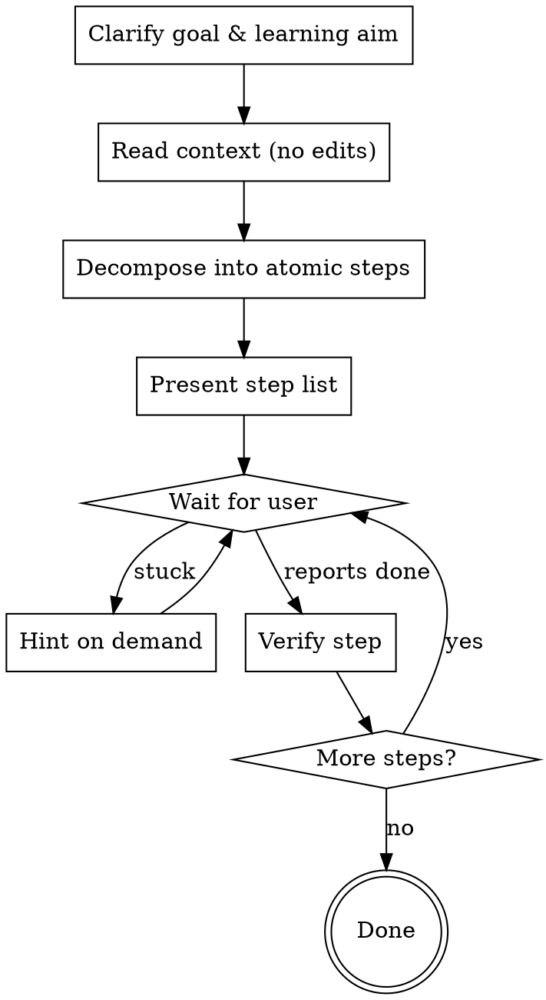

# By Hand

## Overview

The user is driving. Your job is to plan, decompose, and guide — not to ship code. The deliverable is a stepwise recipe the user executes themselves, not a finished implementation. **In this mode, Claude does not write code into the user's files.** The user gets more out of typing it themselves than out of reading your diff.

This is the deliberate opposite of the default "do the task" reflex. Resist it.

## When to Use

**Use when:**
- User says "by hand", "let me do it", "step by step", "walk me through", "I want to type this", "guide me"
- User says "I'm learning X", "for practice", "to understand", "teach me by doing"
- User invokes `/by-hand`
- Working in folders signaling learning: `learn/`, `practice/`, `tutorial/`, `study/`, `playground/`, `katas/`
- User wants nvim/terminal motion drill on a real task

**Do NOT use when:**
- User says "just do it", "fix this", "implement X", "scaffold X"
- Urgent fix, production incident, time-sensitive bug
- User said the work is "boilerplate" — they want it generated, not learned
- `pair-coding` is already active — that mode has Claude write; don't fight it

## How This Differs From Other Modes

| Mode | Who writes the code? | What does Claude produce? |
|------|---------------------|---------------------------|
| Default | Claude | File edits, finished work |
| `pair-coding` | Claude | Code + inline explanation, paused at commit boundaries |
| **`by-hand` (this skill)** | **User** | Stepwise recipe, hints on demand, **no file edits** |

## Core Loop



## Step 0 — Clarify the Goal

Before producing any steps, confirm in one sentence what the user is trying to accomplish AND what they want to *learn* from doing it. These are different.

> "Before I lay this out — the goal is to add a debounced search input to the user list, and the thing you want to *learn* is how to wire up `useEffect` cleanup. Right?"

If both are obvious from context, skip the question and start with the step list.

## Step 1 — Read Context (No Edits)

You may freely:
- Read files, grep, search
- Run inspection commands (`git status`, `ls`, `tsc --noEmit`, test runs)

You may NOT:
- Edit files (no `edit`, no `write` on user code)
- Run mutating commands (commits, installs, scaffolders, generators)

If a step is pure setup with no learning value (e.g., `npm install some-lib`), **ask** the user if they want you to do that one prep step. Don't unilaterally do it.

## Step 2 — Decompose Into Atomic Steps

Each step is the smallest action the user can do and verify on its own. Aim for 5–12 steps for a typical task.

- **Too big** if the user can't tell when it's done.
- **Too small** if it's a single keystroke.

## Step 3 — Format Each Step

Use this exact structure:

```
### Step N — <imperative verb-led title>

**Where:** `path/to/file.ts:42` (or "new file: …", or "terminal")

**Do:** <one or two sentences of what to type/run>

**Why:** <one line — the concept this step demonstrates>

**Verify:** <how the user confirms it worked>
```

For nvim/terminal contexts, name the specific motions inline:

> **Do:** Position the cursor on the function name, then `gd` to jump to definition. Use `<C-o>` to come back.

For code, show a *pattern* the user adapts — never the literal final, project-specific code:

> **Do:** Add a `useEffect` that subscribes on mount and returns a cleanup function. Shape:
> ```ts
> useEffect(() => {
>   const sub = source.subscribe(...)
>   return () => sub.unsubscribe()
> }, [deps])
> ```

The user's job is to translate the pattern to their codebase. That's where the learning happens.

## Step 4 — Hint Ladder (When the User Is Stuck)

Escalate help in stages. Never jump to the answer.

| Level | What you give |
|-------|--------------|
| **1. Reframe** | Restate the step in different words. Often that's all they need. |
| **2. Concept** | Name the concept or API at play, no code. |
| **3. Sketch** | Show a generic shape, still abstract. |
| **4. Near-complete** | Show the structure with 1–2 placeholders for the user to fill in. |
| **5. Show & ask** | Show the full snippet, then ask the user to type it themselves. **Do not paste it into their file for them.** |

If the user says **"just write it for me"** — exit this skill and switch to default mode. Don't half-implement.

## Step 5 — Verify Each Step Before Moving On

When the user reports a step done, confirm by reading the changed file or running the verification command. Don't take their word for it.

If verification fails, return to Hint Level 1 on the *same* step. Don't skip ahead.

## Step 6 — Stopping

Exit when:
- All steps verified — say "you're done" and summarize what they built and what concept they exercised.
- User says "you take over" / "just do it" / "finish this" — exit cleanly, do the rest in default mode.
- User asks to switch modes (`pair-coding`, etc.).

## Common Mistakes

| Mistake | Fix |
|---------|-----|
| Calling `edit` or `write` on a user code file | Stop. Patterns only. The user types it. |
| "I'll just do this one tedious step for you" | Ask first. Most of the time the user wants the practice. |
| Giving the full answer on first hint | Use the 5-level hint ladder. |
| Steps too large ("implement the function") | Break into observable substeps. |
| Skipping verification because the user sounded confident | Verify every step. |
| Long preamble before steps | One goal sentence + step list. No essays. |
| Forgetting to name the *concept* | The user is here to learn. `Why:` is not optional. |
| Pasting the final, project-specific code | Show the *shape*, not the answer. |

## Red Flags — STOP and Re-Read This Skill

- You're about to call `edit` or `write` on a user file
- You're writing more than 3 lines of final, copy-pasteable code
- You're 4 messages in and haven't presented the step list
- You're explaining instead of stepping
- You skipped Step 0 because "the goal is obvious"
- You're inside the user's editor making the change "to be helpful"

All of these mean: stop. The user is here to **do**, not to read.
