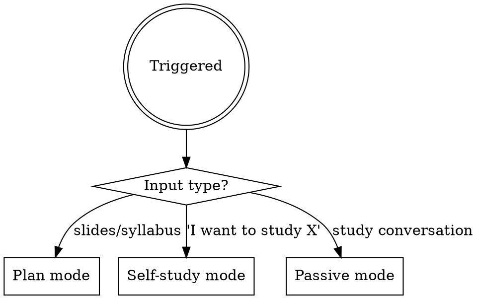

# Course Study Path Builder

## Overview

Builds and maintains a dynamic, incremental study plan for any course or self-directed learning topic. Runs in three modes:

- **Plan mode** — when slides or course content are provided
- **Self-study mode** — when the user wants to learn a topic without a formal course
- **Passive mode** — during any study conversation, watching for gaps and interests



---

## Self-Study Mode

Triggered when the user says they want to study or learn a topic (no course, no slides). This mode runs a full intake → research → build cycle and produces a file-based study plan.

### Phase 1 — Intake (Grill the User)

Before planning anything, understand what the user actually wants. Ask questions **one at a time**. For each question, provide your recommended answer so the user can confirm or correct.

Resolve the following, in order:

1. **Trigger** — why now? Career goal, intellectual curiosity, project need?
2. **Domain context** — what kind of systems/work will this be applied to?
3. **Aesthetic** — what about this topic excites them? Patterns, abstractions, formal models, practical tools?
4. **Gap analysis** — where do they feel lost or inarticulate right now? Give concrete options to choose from.
5. **Baseline** — what have they actually internalized (not just been exposed to)?
6. **Format and time** — session length, preferred format (read/watch/hands-on), how they study (context switching, deep blocks, etc.)

Do not proceed to planning until you have clear answers to all six. When the intake is complete, summarize your understanding back to the user and ask for confirmation before moving on.

### Phase 2 — Research All References

Before writing a single task, research the actual structure of every resource you plan to cite. Use a general-purpose agent for this — it can run in parallel across many resources.

For each resource, find:
- Exact chapter/section titles (not guessed, not approximated)
- Approximate reading/watching time per section
- Prerequisites assumed by the resource
- Key concepts covered

**Rules:**
- Never invent a chapter name — verify it or omit it
- Never assert a resource is freely available unless certain — say "search for [title]" instead
- Only cite a resource if you have verified its structure; flag anything unverified explicitly

After research, identify **clusters**: groups of resources that share a conceptual thread and should be read together or in sequence. Note the cluster's reading order and why.

### Phase 3 — Build the Learning Path

Structure the plan as **phases**, each with:
- A clear goal (one sentence)
- A time estimate
- A **connective note** explaining how this phase feeds into the next

Within each phase, group resources into **clusters** with:
- An explicit reading/watching order
- A brief rationale for the order ("read X before Y because Y assumes X's vocabulary")
- Each item labelled with type, resource, exact section, time estimate, and a hands-on follow-up where applicable

**The connective thread** — write a short paragraph at the top of the plan naming the single idea that runs through all phases. Every phase should visibly advance that idea.

**ADR per phase** — each phase ends with an Architecture Decision Record exercise. The user writes a 1-page ADR defending a design choice using the vocabulary from that phase. This is the articulation training.

**Session log** — include a table at the bottom for the user to log completed sessions with notes.

**Time summary table** — include a total time estimate table at the end.

### Phase 4 — Create Files

Write the following files to `out/` so the user can copy them to the right place on their local machine:

1. **`out/study-plan-<topic>.md`**
   - Full study plan content
   - All items as `- [ ]` checkboxes
   - Phases, clusters, connective thread, ADR prompts, session log, time summary

2. **`out/interests-<topic>.md`**
   - Header explaining it is a curiosity log for topics outside the active plan
   - Starts empty (single `-` placeholder)

3. **Memory pointer** — use `claw-cli memory save --kind project --course <topic> --title "Study plan"` to persist the plan summary. Include a pointer to where the full files should live locally (e.g., `courses/<topic>/study-plan.md` in the user's Mestrado folder).

**Naming convention for `<topic>`:** use a short slug matching the folder style of existing courses (e.g., `software-arch`, `ce297`). Ask the user if unclear.

---

## Plan Mode

Triggered when the user sends course slides, a syllabus, or lecture content.

### Phase 1 — Course Profile (first invocation only)

If no course profile exists in memory or context, collect it before creating tasks:

- **Bibliography**: titles, authors, shorthands (e.g. `[L]`, `[BV]`)
- **User's lens**: how should material be reframed?
- **Syllabus topics**: what must be covered by course end?
- **Avoid list**: framings or approaches to de-emphasize

If a profile exists in AGENTS.md or memory, load it and proceed directly to task creation.

### Phase 2 — Research Resources

Before writing any tasks, research the actual structure of every resource you plan to cite. Do not rely on assumed chapter names, guessed section titles, or recalled paper structure — verify them.

**For each bibliography book:**
- Search for the actual table of contents (title + "table of contents" or "chapter list")
- Confirm real chapter names before citing them — never invent or approximate

**For each paper or report:**
- Fetch or search for the abstract and section headings to get real structure
- Note the actual sections so focus/skip instructions point to real content

**For each video or lecture series:**
- Search for the actual lecture list or playlist (MIT OCW course page, YouTube playlist)
- Confirm the lecture exists and identify which specific episode covers the relevant topic
- Note approximate duration so the user can gauge time investment

**Only cite a resource if you have verified its structure.** If you cannot verify a resource, either find one you can verify or flag it explicitly as unverified.

### Phase 3 — Creating Tasks from Content

When slides or lecture content is provided:

1. Scan for main topics and learning objectives
2. Map each topic to a verified **named chapter** from Phase 2 research (never cite by number alone — editions vary)
3. Assign 1–2 supplementary resources per major topic drawn from Phase 2 findings
4. Add tasks to the plan by writing or updating `out/study-plan-<course>.md`
5. Apply the resource mix rule

### Phase 3 — Gap Updates (no new slides)

1. Run `claw-cli plan show --course <course>` to review the current plan
2. Compare against syllabus topics — identify uncovered content
3. Add tasks for gaps, maintaining resource mix

### Phase 4 — Exercise Phase (only when explicitly requested)

1. Search for exercises in bibliography or linked resources
2. Create tasks pointing to specific problems by name/section
3. Never enter this phase unless explicitly requested

---

## Passive Mode — Gap Detection and Plan Evolution

The study plan is a **living document**. During any study conversation, watch for signals that the plan needs to change — not just additions, but reordering, reprioritizing, or removing items that no longer serve the syllabus arc.

**Signals for adding:**
- User asks "what is X?" about a concept that underpins the current topic
- User's explanation of a concept contains a misunderstanding or conflation
- User expresses confusion about why something works, not just how
- A topic in the plan depends on formal background not yet covered

**Signals for restructuring:**
- New context from class (slides, professor's emphasis) changes what matters next
- A completed step reveals that remaining items are in the wrong order
- The user's understanding has advanced past low-priority items, making them skippable
- A gap means a high-priority item should be inserted before the current next step

**When detected:**
- Update the study plan by writing a revised version to `out/plan-update-<course>.md` and note what changed
- Briefly note to the user what changed and why: *"I've reordered the plan — X should come before Y now because..."*
- Do not interrupt the conversation to ask permission; just update and mention

---

## Passive Mode — Interest Tracking

During any study conversation, watch for signals of genuine curiosity beyond the current scope:

**Signals:**
- User asks a "what if" or "how does this connect to..." question
- User shows enthusiasm about a tangential topic or adjacent field
- A topic sparks a question the plan doesn't answer but is worth following

**When detected:**
- Use `claw-cli note save --course <course> --kind interests --content "..."` to log the interest, or write to `out/interests-<course>.md`
- Format: `- [Topic] — [Why it came up, what the thread is, suggested entry point if obvious]`
- Do not create a task for it; just log it
- Briefly note to the user: *"Noted that for later — added to your interests log."*

---

## Resource Mix Rule (Plan Mode)

Per major topic, always include at least:

- **1 Reading** — chapter name + section + what to focus on and what to skip, filtered through the user's lens
- **1 Video or lecture** — free preferred (MIT OCW, YouTube, open courseware)
- **1 Reflection task** — an explicit prompt connecting the topic to the user's lens or adjacent concepts

Preferred sequence: **Read → Watch → Reflect → (Exercise on request)**

Never place two resources of the same type consecutively.

---

## Task Format (Plan Mode)

```
[Type]: [Topic] — [Specific pointer and focus note]
```

Types: `Read`, `Watch`, `Reflect`, `Exercise`, `Skim`, `Review`

Examples:
- `Read: [Author shorthand] "Chapter Name" — focus on X; skip Y`
- `Watch: MIT OCW 6.042 Boolean algebra — connect to topic Z`
- `Reflect: Reframe concept A as formal object B — what does that reveal?`
- `Exercise: [Ref] Ch. "Topic" — problems on section X`

## Priority Labels (Plan Mode)

- `high` — core course content, likely assessed
- `medium` — deepens understanding through the user's lens
- `low` — optional enrichment, bridges to adjacent fields

---

## Rules (all modes)

- **Research before planning** — always complete resource research before writing any tasks; never cite a resource whose structure you have not verified
- **No invented chapter names** — if you cannot confirm a chapter name, search for it; if you still cannot find it, say so and omit the citation rather than guessing
- **No unverified free access claims** — if you are not certain a resource is freely available, say "search for [title] on [author's site / arXiv / MIT Press open access]" rather than asserting it is free
- Always cite chapters by **name**, not number
- Do not proactively seek free alternatives — cite the best resource; the user will ask for a substitute if they cannot access it
- Do not place two resources of the same type consecutively (Plan Mode)
- Do not enter the exercise phase unless explicitly requested
- Always filter focus notes through the user's stated lens and aesthetic
- Gap tasks are added silently and mentioned briefly — never interrupt the flow to ask permission
- Interest notes go to the log only — never to the active task list unless the user later asks to pursue them
- **File structure**: plan files are written to `out/` for the user to place locally; use `claw-cli memory save` for memory pointers
