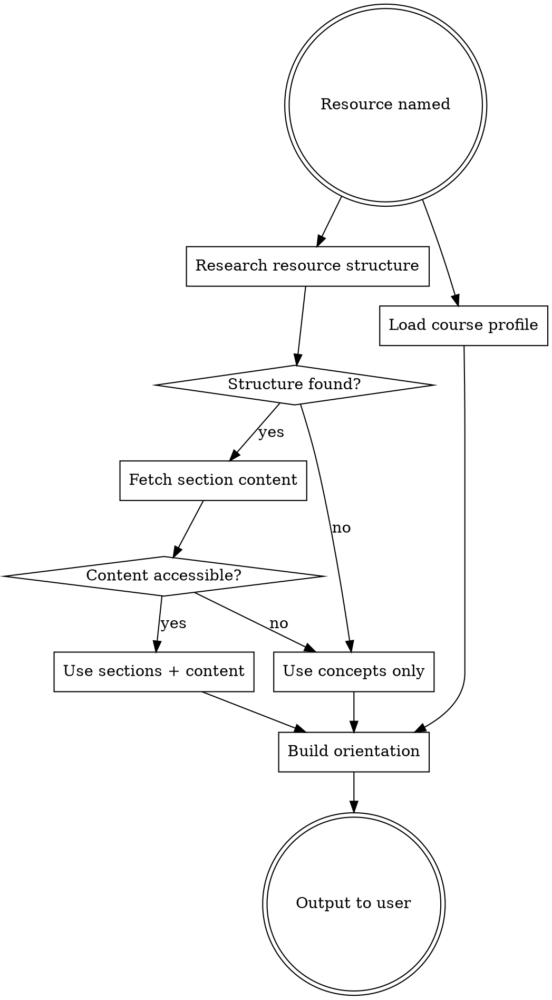

# Resource Orientation

## Overview

Before the user engages with a resource, provide a structured orientation: how to read it, what matters most (specific sections when findable), what to hold in mind, and how to take notes effectively.

## Trigger Signals

**Default (no phrase needed):** invoke this skill *automatically* before the user opens any new 🔴 Read task in the study plan, when orientation has not already been run for that resource in the current session.

**Explicit triggers:**
- "I'm starting [resource]"
- "I'm about to read / watch / go through [resource]"
- "Beginning [resource] now"
- User names a specific paper, chapter, or lecture for the first time

If the user simply asks for the next task and the next task is a Read, run this skill *before* presenting the task — produce the orientation, then present the task with the orientation as scaffolding.

## Process

### Step 1 — Research the resource structure

Use `claw-cli web fetch <url>` or `bash curl <url>` to find:
- Abstract, table of contents, or section headers
- Author's stated purpose or framing
- How the community uses this resource (survey vs. deep read vs. reference)

If the resource is a book chapter, search for the chapter name + author + "summary" or "overview". If it's a paper, fetch the abstract and section headings from the PDF or a freely available source.

### Step 1b — Fetch the specific section content

Once you know the structure, fetch the actual content of the section the user is about to engage with:
- If it's a paper: fetch the specific section (Introduction, Methodology, etc.) from the PDF or an open-access version
- If it's a book chapter: search for the chapter content directly — try `claw-cli rag search <key terms>` against the corpus first, then fall back to `claw-cli web fetch`
- If it's a lecture/video: search for a transcript, slides, or summary of that specific lecture

Use the fetched content to identify concrete claims, definitions, or arguments in that section — not just what the section is about, but what it actually says. This is what makes the orientation specific rather than generic.

If the content is behind a paywall or otherwise inaccessible, proceed with structure only and note the limitation.

### Step 2 — Load course objectives

The course profile is already available in AGENTS.md, which is auto-loaded in the sandbox. Read it from context. Identify:
- The **learning lens** (e.g., formal/theoretical framing)
- The **syllabus topics** this resource serves
- **Specific directives** for this type of content (e.g., "treat safety constraints as formal invariants")
- **Avoid list** (e.g., no ODE framing, no numerical methods as primary output)

### Step 3 — Build the orientation

Produce the following sections:

#### How to approach this resource
Match the reading strategy to the resource type:
- **Taxonomy paper** (like Laprie): read for definitions, build a concept map, annotate distinctions
- **Engineering book chapter**: skim structure first, then read for formal underpinnings, skip heuristics without formal basis
- **Lecture/video**: pause after each claim and restate it formally before continuing

#### Most important sections / concepts
Ground this in the actual content fetched in Step 1b:
- Quote or paraphrase the key claims, definitions, or arguments from the section
- Say what to focus on and what to skim, with reference to specific content (not just section names)
- If section content was inaccessible, fall back to naming 3–5 core concepts and explaining what precision matters and why
- Filter all of this through the course lens from Step 2

#### Things to hold in mind
2–4 orienting thoughts tied to course objectives. These are conceptual anchors — the ideas that should stay active while reading.

#### Prediction (MANDATORY — generation effect)
Before the user opens the resource, ask one closing question: **"What do you predict the key idea of this section will be? One sentence."** Wait for the answer. Note the prediction internally so it can be compared against the actual content during or after reading. Pedagogic basis: Slamecka & Graf (1978) — generation outperforms recognition; producing a prediction surfaces existing schemas and creates a productive gap when the prediction is wrong.

#### What's important for notes
Identify what from this resource is worth capturing later — don't prescribe how to take notes (that belongs to the note-taking skill). Two lenses:
- **For the course:** What concepts, arguments, or claims from this resource are load-bearing for later syllabus topics? What will reappear or be built upon?
- **For the user's interests:** What ideas connect to their broader intellectual threads (formal foundations, thesis directions, cross-domain links)? What's worth sitting with beyond the course requirements?

### Step 4 — Run the reading in segments (🔴 Read tasks)

A long reading is not one passive pass. After the orientation, run the reading as a **segmented active-reading loop** — reading is verified, not assumed (ADR 0012).

**Chunk it.** For a long reading, propose **page-range chunks** (e.g. "Let's do pp. 40–48 first, then pause"). Size each chunk to one coherent idea or section — typically 5–12 pages. A short reading (a few pages, one tight section) stays **whole** — don't over-segment.

**Per chunk:**
1. **Predict** (generation effect, as in the Step 3 prediction): before the chunk, ask for a one-sentence prediction of its key idea. For the first chunk this is the orientation's prediction; for later chunks, ask fresh.
2. The user reads the chunk.
3. **Verify position before accepting "done".** You can see the learner's current page in the `<reading_state pdf="…" page="N/total"/>` block injected into the conversation. When they say they've finished a chunk, check that page against the chunk's range. If it doesn't reach the chunk end, say so and don't advance — *"`<reading_state>` shows you on p. 43, but this chunk runs to 48 — finish it before we recall."*
4. **Boundary recall / self-explanation** (testing effect): ask them to recall the chunk's main idea in their own words, or to self-explain how it connects to the prediction and to prior chunks. Compare silently against the content; surface gaps. Then compare their prediction to what the chunk actually said.

**At the end of the reading:** a full recall of the whole reading's thread + a confidence check before marking the task done.

**Discourage passive rereading.** If the learner is stuck, do *not* tell them to "read it again." Rereading feels productive but is among the weakest study techniques (Dunlosky et al. 2013). Instead prompt retrieval, self-explanation, or a targeted re-read of one specific passage with a question to answer.

## Output Format

Use clear section headers. Keep the orientation output (Steps 1–3) under ~400 words — dense but scannable. Lead with the most important thing first (usually the approach or the key section list). The Step 4 segmented-reading loop runs conversationally *after* the orientation, one chunk at a time — not as part of the upfront block.

## Common Mistakes

- **Too generic:** "read carefully and take notes" is useless. Name sections, name concepts, name the exercise.
- **Ignoring the lens:** always filter through the user's theoretical framing, not the author's intended audience.
- **Adding exercises:** exercises belong in the study plan, not in orientation. Don't include focus exercises or "how to use Claude" sections.
- **Skipping research:** if you don't look up the resource, you'll miss section names and produce vague guidance. Always fetch structure first, then fetch section content.
- **Stopping at the TOC:** knowing that Section 3 exists is not enough. Fetch the actual content of the section the user is starting — the orientation should reference what the section says, not just what it's called.
- **Accepting "done" without checking the page:** for a 🔴 Read task, verify the `<reading_state>` page against the chunk range before advancing — a claimed finish that doesn't reach the chunk end is a signal, not a pass.
- **Telling a stuck learner to "reread":** passive rereading is among the weakest techniques (Dunlosky 2013). Prompt retrieval or self-explanation instead.
