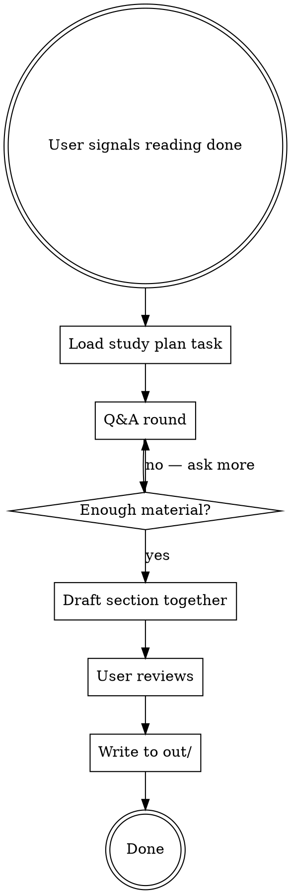

# Study Notes

## Overview

Interactive, collaborative note-taking after a study session. Claude drives a Q&A to check understanding and shape what gets saved — the user never dictates a wall of text, and Claude never writes everything unilaterally.

## Output Format

- **LaTeX article style** (`\documentclass{article}`), clean and minimal
- Written as a readable article the user can return to when anything is unclear — not bullet dumps
- **References**: only cite sources explicitly listed in the course study plan or that the user confirms they read. Never add external references.
- **One file per course** — always append to the existing notes file. Never create a second file for a course that already has one.
- **Location**: output goes to `out/<section-slug>.tex` for the user to paste into their local notes file.

## Process

### Step 1 — Load context

Use `claw-cli plan show --course <course>` to load the study plan task definition (ask the user for the course slug if unknown). Course context is also available in AGENTS.md, which is auto-loaded in the sandbox. Understand:
- What the task asked the user to focus on
- What concepts matter for the course objectives
- What prior notes exist (to connect, not repeat)

Calibrate along **two axes**, both mandatory:

**Axis 1 — Style match to existing notes.** If a notes file already exists for this course, ask the user to paste a representative section or describe the style before drafting anything. Calibrate:
- Section length (line count per section/subsection)
- Theorem environment usage (definitions, remarks, propositions — which are used and how)
- Prose-to-formalism ratio (tight formal remarks vs. discursive paragraphs)
- Cross-reference conventions (`\cref`, `\label` naming patterns)

New sections must be indistinguishable in density and style from existing ones.

**Axis 2 — Weight by syllabus/slide emphasis.** Check the course syllabus and slide coverage for the topic — usually recorded in the study plan (e.g. "Slide coverage:" lines, slide block breakdowns). Allocate section content proportionally to how much weight the course gives each sub-topic:
- Slide-heavy sub-topics → denser treatment, more remarks
- Lightly covered sub-topics → tighter treatment, even if the source chapter goes deep
- A topic absent from slides/syllabus does not earn a section just because the source book covers it

Existing-section density sets the floor (Axis 1); slide weight adjusts the allocation *within* that floor. A syllabus-central topic can exceed the typical section length if slide weight justifies it; a peripheral topic must stay tighter even when the reading was long.

Do not overweight thesis-relevant or personally interesting sub-topics against slide emphasis. If the user is in exam mode, slide weight dominates.

### Step 2 — Conversation rounds

Drive a natural conversation, not an interrogation. Claude's role is to:

- **Set the topic**: open with a claim or observation about the reading that invites the user to react, agree, push back, or expand. Example: "The interesting move Kleppmann makes here is framing reliability as fault-tolerance rather than fault-prevention — that shifts what you optimize for."
- **React and build**: when the user responds, engage with their point. Add precision, offer a connection to course objectives, or gently probe a spot that seems fuzzy — but as part of the conversation, not as a quiz question.
- **Steer toward note-worthy material**: the goal is to surface what matters enough to write down. Pay attention to what the user emphasizes, what they struggle to articulate (worth clarifying in notes), and what they skip (maybe not worth noting).

The tone is two people discussing a reading, where one (Claude) also has an eye on what should end up in the notes.

**Questions**: Use them sparingly and softly — not to test, but to check if something needs clarifying or to open a door the user might want to walk through. A good question sounds like "was there anything in that section that felt fuzzy?" or "anything else you want to dig into here?" — it gives the user a chance to steer without pressure. Avoid pointed, topic-specific questions ("did he distinguish X from Y?") — those feel like prompts toward a predetermined answer.

Do NOT:
- Ask direct comprehension questions ("What is X?", "What's the difference between X and Y?")
- Ask pointed questions that steer toward a specific concept you want to cover
- Ask more than one question per message
- Turn this into an exam or evaluation — the user should feel like they're thinking out loud with a peer
- Assume what the user found important — let the conversation reveal it

### Step 3 — Draft together

Based on the Q&A, draft the LaTeX section. The draft should:
- Read like a short article section, not bullet points
- Capture the user's understanding in their voice, sharpened for precision
- Include only what the Q&A surfaced as worth keeping
- Connect to prior notes when relevant

Write directly to file — don't show the draft for approval unless the user asks to review first.

### Step 4 — Write to file

Write the LaTeX section to `out/<section-slug>.tex` so the user can paste it into their local notes file and compile locally. Remind the user to compile with `pdflatex` on their machine after pasting.

- Use `\section{}` or `\subsection{}` matching the task structure and the existing section hierarchy
- Add `\cite{}` references only for sources in the study plan bibliography
- If no notes file exists yet for the course, include a minimal preamble and `\begin{document}` / `\end{document}` scaffold in the output so the user can initialize the file locally

## Common Mistakes

- **Writing everything**: the point is selectivity. The Q&A determines what's worth saving, not the chapter's table of contents.
- **Skipping Q&A**: never go straight to writing. The conversation IS the process.
- **Adding external references**: only cite what's in the study plan or what the user explicitly read.
- **Bullet-point notes**: write article prose. The user wants something they can re-read fluently.
- **Style mismatch**: if an existing notes file is present, calibrate to its style before writing a single line. A new section that is 4× longer or uses different theorem environments than the existing ones is a failure. Check line counts. Match density exactly.
- **Ignoring slide weight**: allocating section space by the source chapter's structure instead of the course's emphasis. If the slides give four equal blocks and the chapter has one dominant theme, the notes follow the slides, not the chapter. A thesis-relevant aside that takes more space than a syllabus-central topic is a failure of proportion.
