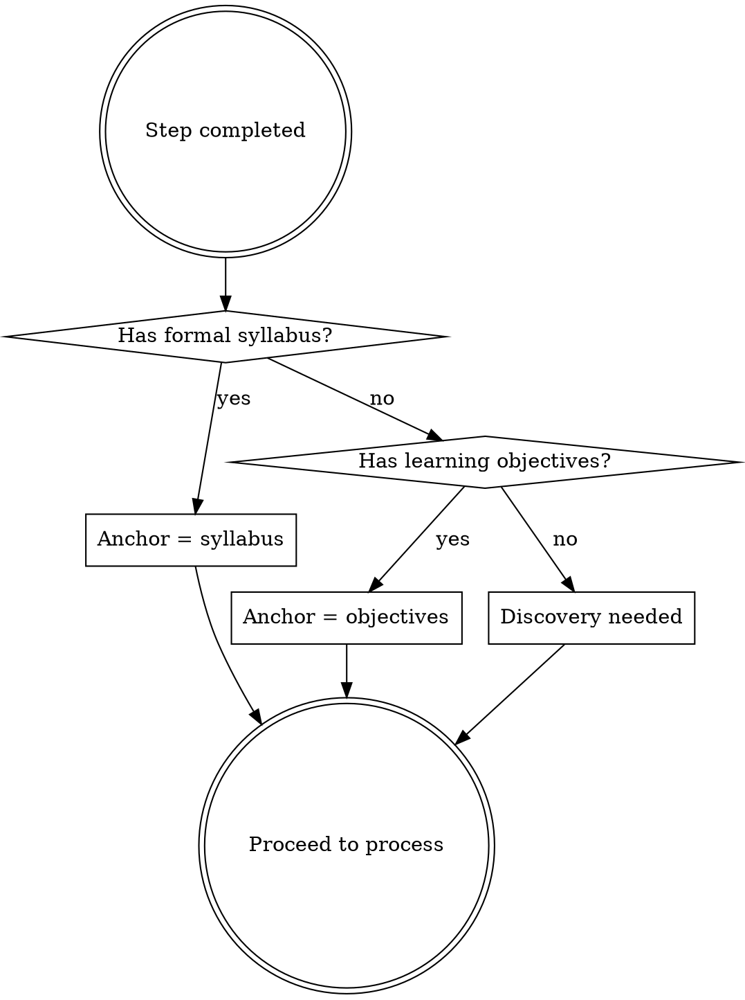

# Study Step Complete

## Overview

When the user completes a study plan step, anchor what they learned to the **governing structure** — a course syllabus or self-directed learning objectives — update the plan, and identify the next step. The governing structure is the authority; the study plan serves it.

## Which anchor?

**Formal course** (e.g., CE-297): The syllabus and course arc are the anchor. Rigid structure — the plan serves the syllabus.

**Self-directed learning** (e.g., software architecture): The user's objectives and the conceptual map that emerged during planning are the anchor. Flexible structure — the plan can reshape the objectives if the user's understanding has shifted. After a completion, ask: "does this change what you're trying to learn, or just how you're getting there?" If the former, update the objectives in memory too.

**No anchor exists yet**: If this is the first completion and no course profile or learning objectives exist in memory, run a brief discovery before anchoring:
- What are you trying to get out of this? (1 sentence goal)
- What prompted you to study this? (context for prioritization)
- Save the answer as the initial anchor in memory using `claw-cli memory save`, then proceed

## Process

### Step 1 — Load context (parallel)

Run in parallel:
- Read the **course arc / objectives** from AGENTS.md (auto-loaded) or search memory with `claw-cli rag search --query "<topic> arc" --course <course>`
- Read the **course profile** if it exists (syllabus, bibliography, learning guidelines) — check AGENTS.md first
- Read the **study plan** using `claw-cli plan show --course <course>`
- Read the **completed work** — ask the user to paste relevant excerpts, or check fleeting notes via `claw-cli rag search --query "<topic>" --course <course>`

**Critical:** The governing structure (syllabus or objectives) is the primary anchor. The study plan is secondary.

### Step 2 — Anchor to governing structure

**For formal courses:**
- Which syllabus items does this work cover or advance?
- What conceptual position does this work establish relative to the course arc?
- What remains open — not from the study plan, but from the syllabus's demands?

**For self-directed learning:**
- Which learning objectives does this advance?
- Has this step changed the user's understanding of *what they need to learn*? (objectives are mutable)
- What territory has opened up that wasn't visible before?

In both cases, frame the anchoring as a **position in a narrative**, not a checklist update.

### Step 3 — Update the study plan

The study plan is a **living document** — not just a checklist. Every completion is an opportunity to restructure, not just check a box.

- Mark completed items done using `claw-cli plan toggle --course <course> --task <n>` (use the task index from `plan show` output)
- Summarize what's covered (brief — the user can read their own notes)
- Note remaining angles worth revisiting (non-blocking, clearly marked as such)
- **Restructure if needed:** for structural changes beyond toggling (reordering, adding/removing tasks, rewriting focus notes), write a revised plan to `out/plan-update-<course>.md` for the user to review and apply

### Step 4 — Save structural insights (if any)

If the completed work revealed something about the **course/topic structure** that future planning needs:
- Use `claw-cli memory save --kind project --course <course> --title "Updated arc"` to persist the insight
- For self-directed learning: update the objectives if they shifted — note what changed and why
- (AGENTS.md is auto-regenerated per session from memory; no need to update it directly)

**Only save** if the insight changes how future steps should be planned. Don't save routine completions.

### Step 5 — Recommend next step

Based on the governing structure (not just the study plan order), identify:
- What the logical next resource/task is
- Why it's next (how it connects to what was just completed)
- One sentence on what to watch for

## Red Flags

| Mistake | Fix |
|---------|-----|
| Anchoring to study plan tasks instead of syllabus/objectives | Always start from the governing structure |
| Treating the study plan as the source of truth | The syllabus or objectives are the authority |
| Long summary of what the user already knows | Keep the anchoring to position and connections, not recap |
| Skipping memory update when a structural insight emerged | If it changes planning, save it |
| Recommending next step without explaining the connection | Always say *why* it's next in the narrative |
| Treating self-directed objectives as fixed | Objectives can shift — check whether the completion changed what the user is trying to learn |
| Not running discovery when no anchor exists | Don't anchor to nothing — ask the two discovery questions first |
